<div align="right">

</div>

# TP 2

## Repositorio de Maximiliano Sorin - 111688 - msorin@fi.uba.ar

- Para compilar:

```bash
gcc tp2.c ./src/abb.c ./src/lista.c ./src/hash.c ./src/csv.c ./src/split.c ./src/pokedex.c ./src/logica.c ./src/menu.c ./extra/engine.c ./src/pokemon.c -o tp2
```

- Para ejecutar:

```bash
./tp2 ./datos/pokedex.csv
```

- Para ejecutar con valgrind:
```bash
valgrind ./tp2 ./datos/pokedex.csv
```
---
##  Funcionamiento
Explicacion diagramas de estructuras: Las cajas en el stack son las variables, los rectangulos con lineas son punteros que apuntan a una variable en el heap. Estas variables tienen como nombre el tipo de objeto al que el puntero apunta. Las funciones son la estructura similar a un diamante.
Hice que los char* apunten a una cantidad x de char. Esta cantidad x solo tiene un significado si hay varios char* como en pokemon_t donde el nombre del pokemon puede almacenar mas char que su color por ejemplo.
### Funciones de pokemon.c
Estructuras de pokemon:
pokemon_t:
<div align="center">
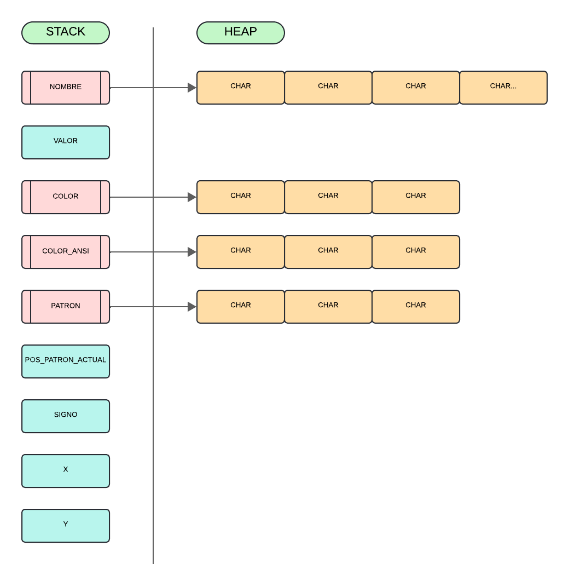
</div>

`poke_crear`: Reservo memoria para todos los campos del pokemon. Asumo que los colores y el patron no tendran mas de 29 caracteres y asumo que el nombre no sera mayor a 99 caracteres. Inicializo los valores a 0 y le pongo como signo un ' ' para marcar que esta vacio. Si ocurre algun error, libero la memoria reservada.

`poke_modificar__campo__`: Son una serie de funciones que reciben como parametro el pokemon que quiero modificar y el nuevo valor del parametro a modificar. Las unicas funciones que hacen algo en especial son `poke_modificar_patron`, que, en los casos donde el patron que se le paso termina con un '\n', le cambiara el caracter por un '\0', y `poke_modificar_posicion` que se asegura que los valores x e y del pokemon sean superiores a 1, pero inferiores a las constantes de altura y ancho. Esa funcion tambien hace que si se le pasa (0, 0) como valores de X e Y, reiniciara las coordenadas del pokemon al (1,1).

`poke__campo__`: Son una serie de funciones que devuelven el campo que se pide. Todas son basicamente un return pokemon->campo y existen debido a que la estructura del pokemon tiene que ser privada.

`poke_copiar`: Copia los datos del pokemon pasado como segundo parametro a los del pokemon pasado como primer parametro. Ambos pokemons tienen que estar inicializados

`poke_letra_patron_actual`: Es una funcion hecha para ser puesta en un bucle o  en una funcion que se repita varias veces. Guarda en una variable la letra en la posicion que marca el campo del pokemon, pos_patron_actual, aumenta en 1 dicho campo y luego me retorna la letra. Una vez que pos_patron_actual sea igual al largo del patron, se va a reiniciar a 0. Es algo asi como un iterador externo que se reinicia cuando se llega al final.

`liberar_pokemon`: Libera toda la memoria reservada para el pokemon en poke_crear.


### Funciones de pokedex.c:
Estructuras de pokedex:
pokedex_t:
<div align="center">

</div>
struct posicion_random:
<div align="center">
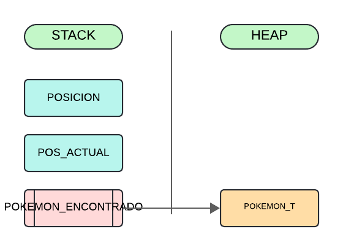
</div>

Aviso por las dudas: En este TDA uso la funcion del tp1 `leer_linea_csv` que, si bien recibe vectores como parametros, pregunte por el discord si se podia usar o si habria que modificarla para que no reciba vectores y lucas me contesto (mediante emotes) que no hace falta modificarla.

`pokedex_crear`: Reservo memoria para todos los campos de la pokedex. Para el ABB donde guardara los pokemons, le pongo como funcion comparadora `comparador_nombres_pokemon` que devuelve el resultado de llamar a strcmp pasandole el nombre del pokemon a comparar y del nuevo pokemon. La tabla de hash abierta colores es recibida por parametro y guarda pares clave-valor donde los nombres de los colores son claves, mientras que los codigos ANSI de dichos colores son los valores y un ejemplo de un par clave valor de ese hash de colores seria {"MAGENTA", "\x1b[35m" }. Decidi que se tenga que dar el HASH por afuera, asi el usuario puede decidir que colores aceptar o si quiere aceptar colores en otros idiomas (si decide hacer eso, solo tendria que hacer un hash que tambien tenga pares clave valor como {"YELLOW", "\x1b[33m"} )

`pokedex_leer_csv`: Reservo memoria para punteros que van a guardar los diferentes valores que hay en cada columna de cada linea del archivo csv que tienen los datos de los pokemons a agregar a la pokedex, liberando la memoria si hay un error. Si no hubo ningun error, le paso los punteros a `rellenar_pokedex_con_filas_de_archivo` que va a guardar los datos de cada fila del archivo csv previamente mencionados en nuevos pokemons que va a insertar en la pokedex. Si no hubo ningun error, va a retornar true o, caso contrario, false. Despues se va a liberar la memoria previamente reservada para los punteros donde se guardarian los diferentes valores de los pokemons y, si hubo un error, se destruiria el ABB donde se guardan los pokemons  y crearia uno nuevo vacio. Esta funcion devolvera true si pudo hacer su funcion sin problemas, o devolvera false si ocurrio un error.
- `rellenar_pokedex_con_filas_de_archivo`: Llama en un bucle a `leer_linea_csv` del tp1, pasandole una series de funciones que guardaran los valores de las columnas de las filas del archivo csv en los punteros que se recibieron por referencia desde `pokedex_leer_csv`. En cada iteracion del bucle, se llama a `añadir_pokemon` para poner los valores de los punteros previamente mencionados a un nuevo pokemon que se va a añadir al ABB de pokemons. Si ocurre algun error, se para la iteracion (que solo deberia de parar una vez que se termina de leer el archivo csv) y se devuelve false, caso contrario, se devuelve true.
    - `añadir_pokemon`: Reserva memoria para un nuevo pokemon y se fija con `hash_contiene` si la pokedex admite el color que va a tener el pokemon (o sea si existe el color del pokemon que se saco de la fila del arhico csv en el hash de colores). Si ocurrio un error al reservar la memoria o si no se encontro el color en el hash de colores, se devuelve false y se libera la memoria. Caso contrario, con las funciones de `poke_modificar__campo__` le pongo los valores de los punteros pasados por parametro al pokemon y retorno lo que retorna la funcion `abb_insertar` al insertar el nuevo pokemon al ABB de pokemons.

`pokedex_mostrar`: Llama a la funcion `abb_iterar_inorden` pasandole como funcion `mostrar_pokemon` para llamarla para cada elemento del ABB de los pokemones. Debido a que esta hecha para que sea una de las opciones que el menu tiene que mostrar en `mostrar_opciones`, se retorna 1 si no ocurrio ningun error (lo que hace que el menu siga abierto) y se retorna 0 en caso contrario (lo que cerraria el menu). `mostrar_pokemon` Simplemente tiene un printf con todos los valores de los pokemons y solo retorna falso si el pokemon es NULL.

`pokedex_cantidad`: Si la pokedex es NULL, devuelve 0. Caso contrario, devuelve lo que devuelva la funcion `abb_cantidad` al pasarle el ABB con los pokemons.

`pokedex_destruir`: Libera toda la memoria que se reservo para la pokedex. Se llama a `abb_destruir_todo`  para liberar la memoria del ABB con los pokemons.

`pokedex_destruir_todo`: Libera toda la memoria que se reservo para la pokedex. Se llama a `abb_destruir_todo`  para liberar la memoria del ABB con los pokemons.

`pokemon_random`: Se retorna NULL si la pokedex pasada como parametro es NULL o si no tiene pokemons dicha pokedex. Si no pasa eso, se reserva memoria para un struct posicion_random y se le coloca como campo de "posicion" un numero aleatorio generado por `rand` y se pone en su campo de "posicion_actual" un 0. Despues de eso se llama a `abb_iterar_inorden` pasandole la funcion `encontrar_pokemom_random` y el struct posicion_random al que le acabo de reservar memoria.  Una vez completada la iteracion del ABB, guardo en un pokemon_t* auxiliar el pokemon que `encontrar_pokemom_random` guardo en el struct posicion_random, libero la memoria que reserve previamente y devuelve el pokemon.
- `encontrar_pokemom_random`: Esta es una funcion creada para ser usada en un `abb_iterar_inorden` que siempre devolvera true, aumentando el valor de "posicion_actual" del struct posicion_random hasta que llegue a valer lo mismo que el valor random que se le habia dado al struct en su campo de "posicion". Una vez que ocurra eso, la funcion devolvera false (parando la iteracion del ABB) y poniendo en el campo de "pokemon_encontrado" del struct el pokemon en el que se encuentra la funcion. 

`pokedex_hash_de_colores`: Si la pokedex pasada como parametro es NULL, se devuelve NULL. Caso contrario, se devuelve el hash de colores de la pokedex.


### Funciones de logica.c:
juego_t:
<div align="center">
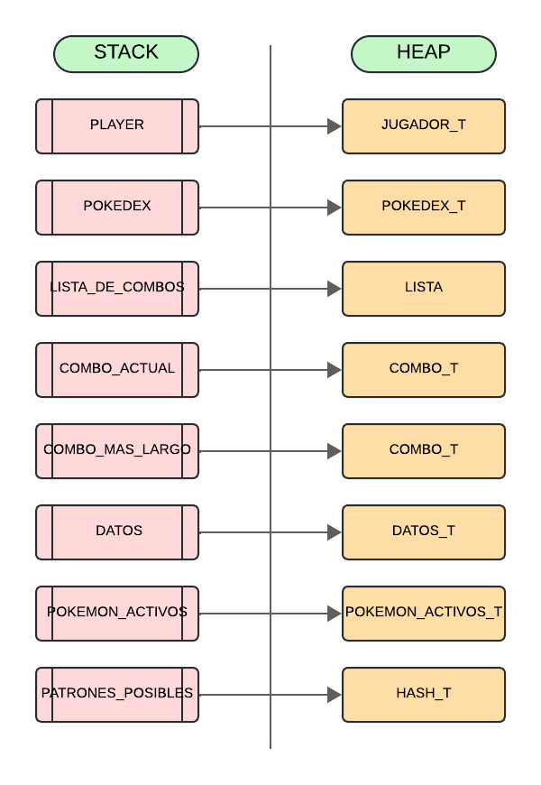
</div>
datos_t:
<div align="center">
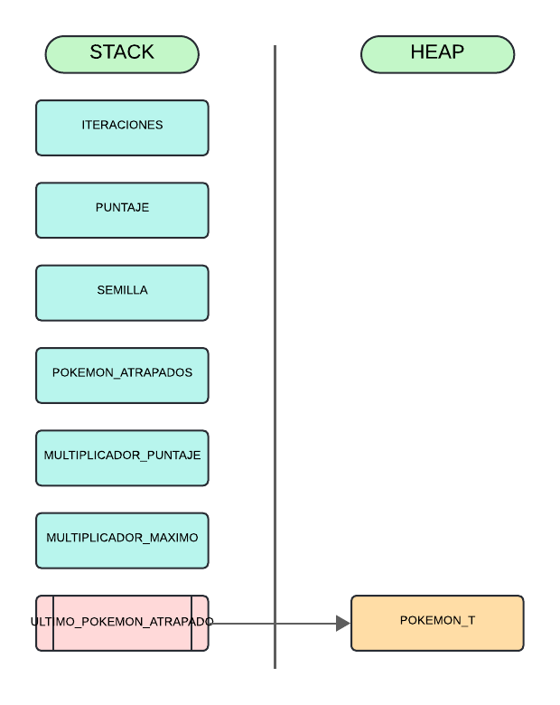
</div>
combo_t:
<div align="center">
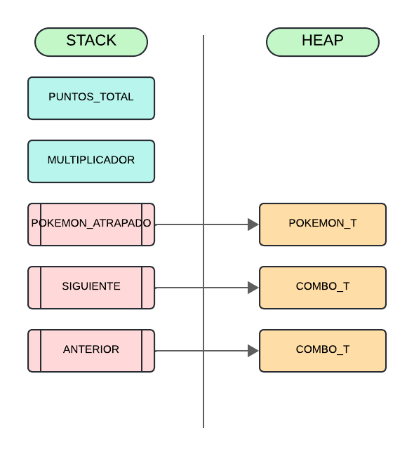
</div>
pokemon_activos_t:
<div align="center">
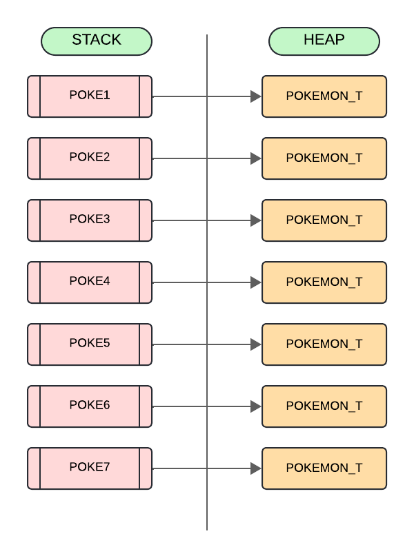
</div>
jugador_t:
<div align="center">
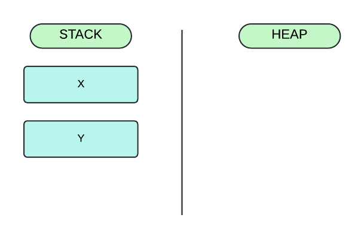
</div>
elem_hash_patrones_t:
<div align="center">
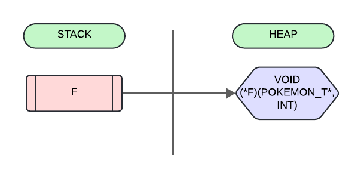
</div>
objeto_matriz_t:
<div align="center">
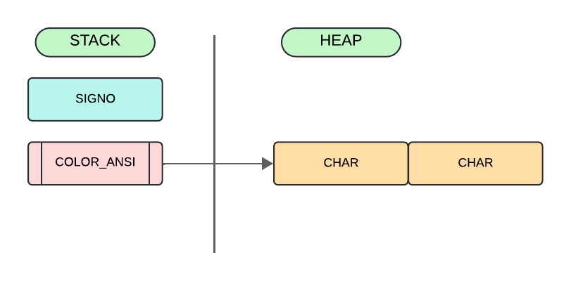
</div>


`logica_crear`: Reservo la memoria para todos los campos de logica, inicializandolos a 0 con calloc. Creo los pokemones del campo de "pokemon_activos" con `poke_crear` y creo un hash con todos los movimientos que puede hacer un pokemon dependiendo de la letra del patron de movimiento con `patrones_posibles`. Para el campo de pokedex de juego_t, pongo la pokedex que se recibio como parametro que puede ser NULL. Si hubo algun error, libero la memoria reservada y retorno NULL.
- `patrones_posibles`: Es una funcion que reserva memoria para un hash y le agrega elem_hash_patrones_t que es una estructura que me permite guardar una funcion void que recibe como parametros un pokemon y una entrada. Cada patron posible tiene su respectiva funcion, por ejemplo, el patron N tiene la funcion mover_norte que llama a `poke_modificar_posicion` para aumentar su coordenada Y (aunque por mi implementacion, tecnicamente sea decrementar, al Y aumentar hacia abajo, en vez de hacia arriba). La mayoria de funciones son sumamente similares, con la exepcion siendo `mover_random` que elija de manera random si aumentar o decrementar en 1 el valor de X o de Y, y las funciones `mover_invertido` y `mover_igual` que mueven al pokemon en la posicion opuesta o en la misma posicion que el jugador. Si ocurrio algun error, se devuelve NULL y se libera le memoria reservada.

`logica`: Se crea una semilla random haciendo uso de la funcion time y se llama a `game_loop` enviandole como parametro el juego recibido como parametro (al cual se le agrego la semilla como valor del campo de semilla)  y la funcion `jugar`. Se retorna 0 cuando termina, al esto hacer que se cierre el menu, si es que se llamo a esta funcion desde dicho menu.

`logica_semilla_especifica`: Se selecciona como semilla del juego la escrita en un scanf y se llama a `game_loop` enviandole como parametro el juego recibido como parametro (al cual se le agrego la semilla como valor del campo de semilla) y la funcion `jugar`.
- `jugar`: Se podria decir que es la principal funcion de este TDA. Recibe como parametros una entrada que el usuario escribe durante el gameloop y el juego en si. Si la pokedex del juego_t no es NULL, se cargan 7 pokemons random como enemigos con `cargar_enemigos`, dandoles posiciones random. Despues, si la entrada es una tecla de direccionamiento ( o sea una flechita), se llama a las funciones `mover_jugador` para mover al jugador, como su nombre lo indica, y se llama a `mover_enemigo` para cada pokemon, para moverlo dependiendo de su patron de movimiento. Despues de eso se llama a `mostrar_texto_superior` para mostrar por pantalla los datos basicos como como moverse, como salirse del juego, cuanto tiempo se tiene, etc...  Posteriormente, se inicializa una matriz de tipo objeto_matriz_t (tipo de data que me permite especificar el signo y el color de cada posicion de la matriz) que sera usada como tablero y se inicializa con memset. Una vez creado la matriz, llamo a `dar_valores_a_tablero` para posicionar a los pokemons, al jugador y a los bordes del tablero en sus apropiados lugares y luego printeo la matriz. Debajo de la matriz se printean todos los pokemons que hay en el tablero y el ultimo pokemon atrapado (si es que se atrapo alguno). Hablando de atrapar, si la entrada fue alguna de las flechas de direccionamiento, se llamara a `atrapar_pokemon` para "atrapar" a todos los pokemons que estan en las mismas coordenadas que el jugador. Si la entrada no fue Q o no pasaron alrededor de 60 segundos desde que empezo `game_loop`, `game_loop` va a volver a repetir el ciclo. Caso contrario, llamara a `crear_combo` con un NULL como pokemon y se agregara al combo_t que devuelve a la lista de combos para especificar que se termino el combo. 
    - `cargar_enemigos`: En mi implementacion, un pokemon o fue atrapado o no existe si su valor es 0, entonces, se llama a la funcion `poke_copiar` para cada puntero dentro de pokemon_activos_t que apunta a un pokemon cuyo valor es 0 para copiar los datos del pokemon random que me devolvio `pokemon_random`. Una vez hecho eso, le doy una posicion random poniendo valores random de rand como parametros de `poke_modificar_posicion`. En resumen, cada vez que se atrapa un pokemon, se pone en una posicion random un pokemon random de la pokedex pasado en `logica_crear`.
    - `mover_jugador`: Aumenta o decrece las coordenadas x e y dependiendo de si la entrada fue una flecha hacia arriba, hacia la izquierda, hacia la derecha o hacia abajo. Una vez hecho eso, actualizo el valor de las coordenadas para que X e Y no puedan superar las constantes de ALTURA y de ANCHO y para que no puedan ser menor a 1 ambas coordenadas. 
    - `mover_enemigo`: Mover enemigo busca la letra actual del patron de movimiento del pokemon con `poke_letra_patron_actual` y se busca su funcion correspondiente con `hash_buscar`, poniendo como parametro de hash  el hash de patrones posibles. Si dicha funcion de hash no devolvio NULL, se activa la funcion de movimiento que devolvio pasandole el pokemon a mover y la entrada que se escribio.
    - `mostrar_texto_superior`: Hace un printf de las instrucciones de como moverse y de como salir y de las actuales iteraciones, tiempo pasado, semilla, puntos y el actual multiplicado de puntos.
    - `dar_valores_a_tablero`: Dependiendo de las coordenadas X e Y de cada pokemon, se pone en la coordenada X e Y equivalente de la matriz el signo y color del ultimo pokemon cuyos datos cambiaron. Esto significa que si un pokemon esta en las coordenadas (10, 5), en las coordenads (10, 5) de la matriz se podra ver su signo con su color. Para asignar el color y signo de cada cuadrado, se le prioridad al signo y color del jugador, los cuales son '@' y 'ANSI_COLOR_WHITE'. Al final de esta funcion se le asigna a los bordes de la matriz un espacio con color blanco que representa el borde.
    - `atrapar_pokemon`: Esta funcion se encarga de llamar a la funcion `seguir_combo` para cada pokemon cuyas coordenadas sean iguales que las del jugador. Dicha funcion va a fijarse si se rompio un combo o si se siguio un combo (por eso el nombre de la funcion) y se fijara cuanto tiene que aumentar el puntaje dependiendo del multiplicador. Una vez hecho eso, llamo a `poke_modificar_valor` para poner el valor de los pokemons atrapados como 0, lo cual, como habia dicho previamente, significaria que el pokemon fue atrapado.
        - `seguir_combo`: En mi implementacion, se ponen combo_ts cuyo campo de pokemon es NULL en la lista de combos para marcar que es el inicio de un nuevo combo o el final de uno. Si, al atrapar un pokemon, este tiene un diferente signo y un diferente color que el ultimo pokemon que se atrapo, se va a pensar como que se rompio el combo, asi que se va a poner en la lista de combos con `lista_agregar_al_final` un combo_t cuyo pokemon es NULL y luego se agregara a la lista con la misma funcion un combo_t cuyo pokemon sera el ultimo que se atrapo que rompio el combo y se reiniciara el multiplicador de puntaje a 1. Si el pokemon atrapado tiene el mismo signo o el mismo color que el ultimo pokemon atrapado, entonces va a aumentar en 1 el multiplicador de puntaje y se guardara en la lista de combos. Tambien se fijara si el combo actual tiene un multiplicador de puntaje mayor al que esta en el campo de "combo_mas_largo" del juego y, si es asi, el nuevo combo pasara a ser el combo mas largo.
            - `crear_combo`: Se reserva la memoria necesaria para un nuevo combo. Si el pokemon pasado por parametro es NULL, se pondra que los puntos totales del combo son 0. Si el pokemon atrapado existe, se sumara a los puntos total del combo los puntos del nuevo pokemon, se le pondra como "pokemon_atrapado" una copia del pokemon atrapado y se le conectara con el anterior combo mediante punteros. Si hubo algun error, se liberara la memoria y se devuelve NULL.
- `datos_finales`: Como el puntero al combo mas largo, apunta al final de dicho combo, actualiza el puntero para que apunte al inicio. Una vez hecho eso, dentro se printea dentro de un ciclo los colores y los nombres de los pokemons atrapados en dicho combo. Al final de todo, se printeara el multiplicador maximo de puntuacion alcanzado y la cantidad de puntos que se alcanzo en total.

`logica_stats`: Se itera mediante `lista_iterar_elementos` cada elemento de la lista de combos, pasandole como parametro la funcion `printear_combo`. Esta funcion permite imprimir cada combo con la forma de "Combo x: --> pokemon1 (p1) --> pokemon2 (p2) -->"... y asi. Al final de cada combo, se imprime la puntuacion total conseguida con dicho combo y el multiplicador de puntos que se alcanzo. Cree esta funcion, porque pense que tendria sentido una funcion que muestre todos los combos que se hicieron.

`logica_destruir`: Se libera toda la memoria que se reservo para el juego_t, llamando a `liberar_pokemon` para cada pokemon de los pokemons activos, `hash_destruir_todo` para liberar la memoria del hash de patrones posibles y `lista_destruir_todo` para liberar la memoria de la lista de combos.

`logica_destruir_todo`: Se libera toda la memoria que se reservo para el juego_t, llamando a `liberar_pokemon` para cada pokemon de los pokemons activos, `hash_destruir_todo` para liberar la memoria del hash de patrones posibles, `lista_destruir_todo` para liberar la memoria de la lista de combos y `pokedex_destruir_todo` para liberar la memoria de la pokedex que se habia pasado como parametro.


### Funciones de menu.c:
menu_t:
<div align="center">
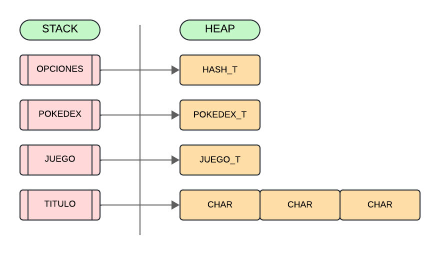
</div>
elem_menu:
<div align="center">
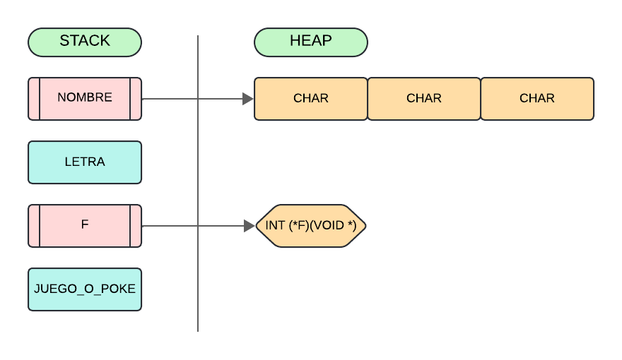
</div>

`menu_crear`: Reservo memoria para el menu y llamo a `hash_crear` para reservar memoria para las opciones del menu. Posteriormente, pongo los punteros pasados como parametros como valores de los campos de pokedex, juego y de titulo del menu_t. Para finalizar, le añado una opcion al menu (que siempre tiene que estar) con `menu_añadir_opcion` que me permitira salir del menu, una vez que se llama a la funcion `mostrar_opciones` que me mostrara todas las opciones en un bucle. Devuelvo false y libero la memoria reservada si ocurrio algun error.

`menu_añadir_opcion`: Se pide como parametros el menu al que se le van a a agregar las opciones, la letra en mayuscula y en minuscula necesaria para activar la opcion, el nombre de la opcion (o sea como se vera en `mostrar_opciones`), una funcion int que pida un parametro void y un valor int que este entre 0 o 2 que identifica si la funcion tiene que recibir NULL, un juego_t o una pokedex_t. Primero se reserva memoria para 1 elem_menu que tendra como clave la letra en mayuscula y en el resto de campos tendra los parametros previamente dichos y luego se reservara la memora para otro elem_menu que tendra como clave la letra en minuscula y que el unico que campo que no tendra vacio sera el de la funcion donde se guardara la funcion pasada por parametro. Inserto ambos elem_menu en el hash de opciones del menu, liberando la memoria si hubo algun error y retonando false, caso contrario retorno true. Hago esto para que la funcion `hash_buscar` me pueda devolver los elem_menu que le pido sin importar de si le paso la clave en mayuscula o en minuscula.

`mostrar_opciones`: Llama a la funcion `hash_iterar` pasandole la funcion `printear` para que haga un printf de todas las opciones que tiene el menu. Despues de eso, busco activar la opcion que quiero en un scanf que se fijara con `hash_contiene` si hay alguna opcion con la clave que el usuario escribio en el scanf. Si no lo hay, se repite lo anterior dentro de un ciclo que solo parara hasta que el usuario escriba en el scanf la clave de una de las opciones (siendo una de las opciones salirse del menu). Una vez que `hash_contiene` devuelve true, le pido al hash que me de el menu_elem que tiene guardado con la clave que le pase llamando a `hash_buscar` y llamo a la funcion que tiene guardado el menu_elem pasandole como parametro NULL, el juego que el menu tiene guardado o su pokedex, dependiendo de si el valor del campo "juego_o_poke" del menu_elem vale 0, 1 o 2 .
- `printear`: Funcion hecha para ser usada en un hash_iterar. Se encarga de solo printear las opciones que se añadieron en `menu_añadir_opcion` que tienen como clave la letra en mayuscula, que lo logra porque las que tienen la letra minuscula como clave tienen NULL como nombre de opcion. Esta funcion printea el valor que tiene el elem_menu como letra y el valor que tiene como nombre. 

`menu_quitar_opcion`: Se pide que se pasen como parametro la clave en mayuscula y la clave en minuscula de la opcion que fue agregada en `menu_añadir_opcion` y se llama a `hash_quitar` para quitar las opciones del hash y se libera la memoria reservada para las opciones encontradas. Si hubo un error se devuelve false y el hash de opciones no habra sido cambiado, caso contrario, se lograra sacar las opciones del hash y se devolvera true.

`destruir_menu`: Se libera toda la memoria reservada para el menu, destruyendo el hash de opciones con `hash_destruir_todo`.

`menu_destruir_todo`:Se libera toda la memoria reservada para el menu, destruyendo el hash de opciones con `hash_destruir_todo` y liberando la pokedex y el juego que tiene como campos el menu con `pokedex_destruir_todo` y `logica_destruir`.

## Respuestas a las preguntas teóricas
### Explicacion TDAs creados:

### `pokedex`: 
- Que hace y para que se utiliza: Se utiliza principalmente para guardar los pokemons de un archivo csv con el formato de `pokemon,valor,color,patron` en un ABB donde los ordena por su nombre. Otra de sus funciones, aparte de la de almacenamiento, es la de poderme dar un pokemon random llamando a `pokemon_random`.
- Datos del TDA: Aparte de obviamente el tipo de dato pokedex_t que contiene un abb_t con los pokemons y un hash_t que tiene como pares clave-valor los posibles colores de los pokemon como clave y  sus respectivos codigo ANSI como valor, el principal dato usado seria el de pokemon_t del TDA de `pokemon`. Sumado a ese dato, la pokedex tambien usa un `struct posicion_random` para poder iterar por el ABB de los pokemon hasta conseguir al que este en la posicion buscada (que en este caso seria una posicion random).
- Operaciones importantes del TDA: 
    + `pokedex_crear` donde se reserva la memoria necesaria para el pokedex y se le pasa un hash que tiene los posibles colores que pueden aparecer en los archivo csv como claves y sus codigos ANSI como valor
    + `pokedex_hash_de_colores` devuelve el hash que se le fue pasado como parametro en `pokedex_crear`.
    + `pokedex_leer_csv` es la funcion que lee el archivo csv con el formato `nombre,valor,color,patron` cuya ruta se le paso como parametro y almacena todos los datos de las filas en pokemons en un ABB ordenandolos por sus nombres.
    + `pokedex_mostrar`  muestra una lista ordenada con todos los pokemons de la pokedex, con sus colores, patrones y valores.
    + `pokemon_random`  me devuelve un pokemon random del ABB de pokemons de la pokedex.
    + `pokedex_cantidad` me devuelve la cantidad de pokemons almacenados en la pokedex.
    + `pokedex_destruir` destruye la memoria reservada para la pokedex y destruye el ABB de los pokemons, junto con la memoria que se reservo para guardarlos.
    + y `pokedex_destruir_todo` que a parte de liberar la memoria que se libero en `pokedex_destruir`, tambien libera le memoria del hash de colores.

### `pokemon`:
- Que hace y para que se utiliza: Se utiliza para crear, recibir y modificar los datos de un pokemon. Si bien se podria argumentar de que no deberia de estar separado del TDA de pokedex, los pokemons no necesariamente necesitan estar en una pokedex y, por toda la cantidad de funciones que no necesitan una pokedex, pense que por claridad estarian mejor en un TDA aparte.
- Datos del TDA: El unico dato de este TDA son los pokemon_t que contienen un campo char* para el nombre del pokemon, otro para su color, otro para su color en codigo ANSI y un ultimo char* para su patron de movimientos. A parte, tiene un campo size_t para su valor, un campo int para por cual letra de su patron de movimiento va y 2 campos int para sus posiciones x e y.
- Operaciones importantes del TDA:
    + `poke_crear`: Reserva la memoria para la estructura pokemon e inicializa sus valores a 0.
    + `poke_modificar__campo__`: Una serie de funciones que se encargan de modificar el dato del pokemon con un simple strcpy si se quiere modificar un string o un simple = sino. La unica exepcion a esta regla es `poke_modificar_posicion` que se asegura que x e y no puedan ser mayor a las constantes ANCHO y ALTURA y que reinicia la posicion del pokemon al (1,1) si se le pasa 0s para aumentar los valores de x e y.
    + `poke__campo__`: Una serie de funciones que simplemente hacen un return del campo del pokemon que se pidio.
    + `poke_copiar`: Copia todos los datos del pokemon pasado como segundo parametro al pokemon pasado como primer parametro.
    + `poke_letra_patron_actual`: Es una funcion creada para ser puesta dentro de un bucle (o una funcion que se repita) que me va a dar en cada llamada el movimiento de su patron de movimiento que le toca hacer. Si se llega al final del patron de movimiento, volvera a empezar desde el primer movimiento. 
    + `liberar_pokemon`: Libera toda la memoria reservada para el pokemon.

### `logica`:
- Que hace y para que se utiliza: Su rol es crear toda la logica del juego en base de la pokedex que se le paso. Si no se le envia una pokedex, entonces el juego no tendra enemigos. Al crear toda la logica de forma interna, solo se necesita llamar a una unica funcion para jugar el juego en si.
- Datos del TDA: Debido a que toda la logica del juego se hace de forma interna, tiene una gran cantidad de tipos datos. El principal tipo de dato es el de juego_t que tiene como campos punteros a otro tipo de dato. Sus campos son un jugador_t (tipo de dato dedicado al jugador), un pokedex_t para guardar la pokedex que se le paso, una Lista para guardar todos los combos, 2 combo_t para guardar el combo que se esta haciendo actualmente y el combo mas largo, un datos_t que seria donde guarda los stats del juego y para terminar un pokemon_activos_t que es donde se guardan los 7 pokemones que estan actuando como enemigos y un hash_t con todos los movimientos posibles que hay que hacer dependiendo de la letra actual del patron.
El tipo de dato del jugador jugador_t guarda las posiciones x e y del jugador. Datos_t guarda la cantidad de iteraciones, el puntaje, la semilla, la cantidad de pokemons atrapados, el multiplicador de puntaje actual y el multiplicador maximo de puntaje y un puntero al ultimo pokemon atrapado. Combo_t es el tipo de dato para los combos y guarda la cantidad de puntos que se consiguio hasta el momento por el combo, el multiplicador de puntos del combo en el momento, el ultimo pokemon que se atrapo y el combo anterior y siguiente (que en mi implementacion significaria el anterior y siguiente pokemon del combo que fueron atrapados). Los ultimos 2 tipos de dato son objeto_matriz_t que guarda el signo y el codigo ansi del color del signo que hay en cada cuadrado de mi tablero y elem_hash_patrones_t que es el tipo de dato que guarda el hash de patrones posibles del juego, que tiene como un unico campo un puntero a una funcion void con unicos parametros siendo un pokemon y un int.
- Operaciones importantes del TDA:
    + `logica_crear`: Reserva toda la memoria necesitada para el  juego. Se recibe una pokedex como parametro de donde se sacaran de ahi los pokemon a atrapar. Si se recibe NULL, no habran enemigos.
    + `logica`: Se pone una semilla random y se llama a la funcion game_loop de la catedra, pasandole como parametro la funcion interna `jugar` y el juego_t.
    + `logica_semilla_especifica`: Se le pide al usuario que escriba la semilla que va a usar y se llama a la funcion game_loop de la catedra, pasandole como parametro la funcion interna `jugar` y el juego_t.
    + `logica_stats`: Muestra todos los combos que se hicieron, la cantidad de puntos que se gano con dicho combo y el multiplicador maximo alcanzado.
    + `logica_destruir`: Libera toda la memoria reservada para la logica.
    + `logica_destruir_todo`: Libera toda la memoria reservada para la logica y tambien la pokedex que se le mando.

### `menu`:
- Que hace y para que se utiliza: Es un hash de opciones las cuales se pueden invocar simplemente escribiendo la letra que tienen como clave en un scanf. Al pedir la letra de la opcion dentro de un ciclo, tienen como default una opcion para salirse del menu.
- Datos del TDA: Tiene 2 tipos de dato, el primer tipo de dato es el menu_t que tiene como campos un hash con totas las opciones del menu que fueron agregadas, 2 campos para guardar la pokedex y el juego que se le paso al crear el menu y un ultimo campo para guardar el string que tiene que aparecer como titulo arriba de las opciones al mostralas. El otro tipo de dato son los elem_menu que existen para guardarse en el hash de opciones del menu. Estos tienen como campo el nombre de la opcion, la letra con la que se llama al campo, una puntero a una funcion int que recibe un parametro void y un int que si vale 0, significa que el parametro de esa funcion tiene que ser NULL, si vale 1 significa que tiene que ser el juego_t del menu_t o, si vale 2, significara que tiene que ser la pokedex_t del menu_t.
- Operaciones importantes del TDA:
    +  `menu_crear`: Reserva toda la memoria necesaria para el menu y se le da como campos de pokedex, juego y titulo los parametros pasados.
    +  `menu_añadir_opcion`: Le permite al usuario agregar opciones para que aparezcan en el menu. Se pide por parametro la letra en mayuscula y en minuscula que se requiere para llamar a la opcion, como va a aparecer la opcion en el menu, la funcion que se va a llamar cuando se active la opcion y un parametro para saber si la funcion necesita que se le pase NULL, una pokedex o un juego_t. Si dicha funcion devuelve 0, entonces se cierra el menu y, si devuelve 1, el menu seguira abierto.
    +  `mostrar_opciones`: Muestra todas las opciones que fueron agregadas al menu. Pide al usuario elegir una letra para activar la opcion y, si el usuario pone una letra que no tiene su respectiva opcion, le va a repetir en un ciclo que escriba una letra.
    +  `menu_quitar_opcion`: Se le pasa como parametros el menu donde se le quiere quitar la opcion y la clave en mayuscula y en minuscula de la opcion a borrar. Se devuelve true si se pudo quitar la opcion.
    +  `destruir_menu`: Se destruye toda la memoria reservada para el menu.
    +  `destruir_menu`: Se destruye toda la memoria reservada para el menu y se destruye la memoria reservada para la pokedex y el juego que se le paso.

### Explicacion TDAs reutilizados:
Al no poder usar vectores, use todos los TDAs que hicimos hasta el momento.
- `TDA split`: Lo unico que hace es dividir un string en varias partes dependiendo del separador que tenga. Por ejemplo, "Hola todo bien?" me lo separaria a {"Hola","todo", "bien?"} si pusiera que ' ' es el separador. Lo uso en conjunto con el TDA de `csv` en el TDA de pokedex. Es el TDA del tp0

- `TDA csv`: Este TDA hace Lee un archivo csv, divide cada columna de la linea usando el `TDA split`, llama a una funcion para cada columna que guardara la informacion queria en un puntero de void que esta dentro de un puntero de punteros void. Hago uso de este TDA en el `TDA pokedex` para poder dividir las lineas del archivo csv con los pokemones de la pokedex, poniendo en cada campo del pokemon, su respectivo "pedazo" de la linea del archivo.

- `TDA abb`: Este TDA me permite guardar diferentes valores un un ABB en donde yo puedo elegir el metodo de comparacion. Lo use en el `TDA pokedex` para guardar los diferentes pokemon del archivo, ordenandolos alfabeticamente dependieno de su nombre.

- `TDA hash`: Este TDA me permite crear una tabla de hash abierto, donde puedo elegir un elemento que guarde en el hash, unicamente teniendo que saber su clave. Tiene varios usos en mi implementacion: Se usa para guardar el codigo ANSI de cada color, teniendo el nombre del color como clave, tambien use el TDA para poder guardar una funcion para poder hacer cada movimiento del patron de movimiento de cada pokemon (teniendo a la letra que identifica el movimiento como clave), y finalmente lo use para guardar todos las opciones del menu, con la letra que se van a usar para activarse como claves. 

- `TDA lista`: Este TDA seria me permite usar una lista enlazada en vez de un vector. Lo hice para poder guardar todos los diferentes combos en una sola lista que me permitira tanto iterarlos para mostrar todos los combos que hizo el jugador, como borrarlos de una forma facil.